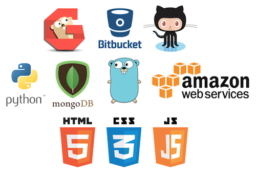

# 디지털아이디어 파이프라인 개발팀 정보
- 디지털아이디어의 개발환경을 공유하고, 원하는 인재를 찾기위해 제작된 문서입니다.
- 영상, 그래픽스에 호기심 많은 개발자를 찾습니다.
- [뉴크](https://www.thefoundry.co.uk/products/nuke/), [마야](http://www.autodesk.co.kr/products/maya/overview), [후디니](https://www.sidefx.com), [RV](http://www.tweaksoftware.com/products/rv)같은 툴을 다룰 수 있다면 아티스트와 대화가 편합니다.
- 위 툴의 기능을 확장하는 형태의 개발이 많기 때문입니다.
- 또한, 사내 많은 컴퓨터가 Linux([CentOS](https://www.centos.org))로 구성되어 있습니다. 리눅스 환경 & 명령어에 익숙하면 유리합니다.
- 그래픽스 라이브러리(OpenGL, OpenCL ... ), 수학, 물리이론을 활용한 경험이 있다면 유리합니다.
- 개인 또는 친구들과 진행하는 프로젝트 사이트, 영상, Github 사이트가 있다면 언제든지 보내주세요.
- 자료첨부시 pptx같은 특정 어플리케이션 데이터보다는 pdf, jpg, mp4같은 범용 데이터를 보내주세요.
- 관계자 자료열람시 OS 환경이 달라서 파일을 열어볼 수 없기 때문입니다.
- 담당자 : 김한웅 / khw7096@gmail.com

## 개발문화
- 매주 화,목요일 오전에 자유롭게 토론, 코드 리뷰를 하고 있습니다.
- [Github](http://www.github.com)를 이용해서 마음맞는 사람들과 오픈소스 개발을 추천합니다.
- 저희 팀은 늘 열려있습니다. 디지털아이디어 개발팀에 관심이 있다면, 회사 근처로 놀러오세요.
- 커피를 마시며 좀 더 자세한 개발 정보에 대한 이야기나, 토론을 해봐요.
- 회사위치: 경기도 고양시 일산동구 호수로 596 ([지도보기](https://goo.gl/maps/TvhB5sgJ4wF2))

## 중요점
- 논리적인 사고력과 문제해결 이끌어가는 능력
- 협업을 할 수 있는 마음가짐

## 사용하고 있는 언어 & DB & 개발도구
- Shell Script : 간단한 리눅스 명령어로 처리하는 업무에 활용합니다.
- [Python](http://www.python.org) : 많은 그래픽스툴에 내장되어 있습니다. 이 툴을 확장하는 형태의 업무가 많습니다.
- [PyQt](https://riverbankcomputing.com/software/pyqt/intro) & [PySide](https://wiki.qt.io/PySide) : Python을 이용한 GUI 제작시 사용됩니다.
- [Golang](http://www.golang.org) : 의존성이 없고, 안정적인 서비스를 만들 때 사용합니다.
- C++ : 빠른 속도가 필요하거나 그래픽스툴을 위한 플러그인을 만들 때 활용합니다.
- 웹언어(HTML5,CSS3,Javascript) : 작업 개선을 위한 웹서비스 제작시 활용됩니다.
- [MongoDB](https://www.mongodb.com) : 사내에서 NoSQL이 필요할 때DB로 활용하고 있습니다.
- [MySQL](https://www.mysql.com) : 사내에서 DB로 활용하고 있습니다.
- [Git](https://git-scm.com) & [Gogs](https://gogs.io) : 사내 버젼관리를 위한 도구 입니다.
- [Bitbucket](https://bitbucket.org/) : 외부업무를 지원하는 개발시 버젼관리 및 리포지터리 서버로 활용합니다.
- [AWS](https://aws.amazon.com) : 외부 서비스를 지원할 때 인프라로 활용합니다.

